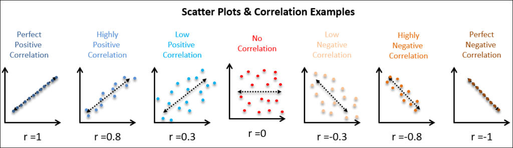

# COSC482 - Assignment 5

## Methodology

### 1. **Scraping**

The `scraper.py` file is responsible for scraping deal information from eBay using the provided link. The script performs the following:

- Scrolls down to the end of the page to load all products.
- Scrapes product details and logs the timestamp for when the data was scraped.

### 2. **Automation**

- GitHub Actions is used to automate the scraping process every 3 hours.
- The automation ran for 2 days before the cleaning process began.

### 3. **Cleaning**

The `clean_data.py` file performs data cleaning by:

- Removing special characters (like `$`) from prices.
- Replacing missing original prices with the available price.
- Filling missing shipping information with 'Shipping info not available'.
- Adding a 'Discount Percentage' column.
- Dropping rows that have all null values using `dropna()`.

---

## Key Findings from Exploratory Data Analysis (EDA)

### 1. **Time Series Analysis**

- A bar chart of sorted products by hour indicates that eBay shows between 60 and 70 deals per hour.

### 2. **Price and Discount Analysis**

- Most products are priced between $0 and $500. Prices then decrease, except for noticeable spikes at $1500 and just before $2000.
- A scatter plot comparing prices with original prices shows a positive correlation: as the price increases, the original price also increases.
- Most original prices are between $0 and $1000, approximately double the discounted price.

### 3. **Shipping Information Analysis**

- The majority of products (over 400) have free shipping, while a minority lack shipping information.

### 4. **Text Analysis on Product Titles**

- The most frequent product categories in eBay tech deals are **Apple** and **Samsung**.
- Bar graph coloring is randomly generated using CSS colors from Matplotlib.  
  [CSS Color Documentation](https://matplotlib.org/stable/gallery/color/named_colors.html)

### 5. **Price Difference Analysis**

- Many deals show significant price differences after discounts, with some showing a shocking difference of up to $250. Some products show no price difference when no discount is applied.

### 6. **Discount Analysis**

- The top 2 products are the same ASUS Zenfone, with an 87% discount.
- The last 3 products are the same Galaxy Watch (234.95$) scraped at different times, they have a discount value of 80%

---

## Challenges

- The automated scraping via GitHub Actions failed several times, requiring an alternative commit to resolve the issue.
- After successful automation, a significant number of missing or null values were encountered, requiring extensive data cleaning.

---

## Potential Improvements

- Fix the automation issues for more consistent scraping.
- Further improve data cleaning, including removing duplicate entries.
